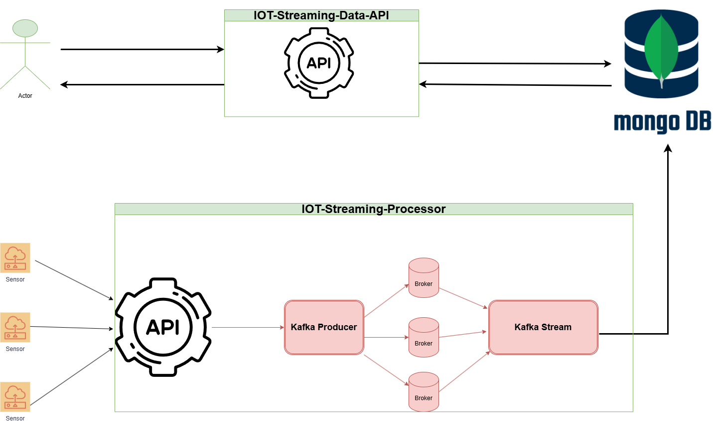
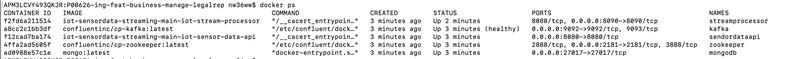

#                         IOT-Streaming-Sensor-Data
* ****
## Overview
* ****
 This project is a real-time IOT sensor data processing pipeline built using Spring Boot, Kafka and MongoDB.
 The application:
- Simulates multiple IOT devices sending sensor readings every second.
- Stream and process data using Kafka (Streams).
- Store sensor reading in MongoDB
- Provides a REST API to query sensor data(min/max/avg reading for specific or group of sensors for a time range)
## Design
* ****

##  Technologies Used
- Java17
- Maven
- Spring Boot 3(Spring web,Spring Data,Spring security, Sparing kafka)
- Kafka 
- MongoDB
- Docker and Docker Compose
- JWT

## Getting Started
* ****
### Requirements
- Docker (MongoDB,kafka)
- Java 17
### Build & Run
- To build and deploy **iot-streaming-data-api** and **iot-streaming-processor** applications using Docker Compose, run following command:
```
docker-compose -f "docker-compose.yml" up --build -d
```
Once all containers are running, you can verify them using:
```
docker ps
```

 
* ****

## API Endpoints
* ****
## iot-streaming-processor
### 1.Start generate Simulated data
- **Endpoint:** **GET** 'http://localhost:8090/generator/start`
- **Description:** This endpoint will schedule to generate test simulated data and send it to kafka.
- **Response Body:**
```
 The Stream Data Generator started successfully!
```
### 2.Stop generating Simulated data
- **Endpoint:** **GET** 'http://localhost:8090/generator/stop`
- **Description:** This endpoint will stop scheduler to generate test simulated data.
- **Response Body:**
```
 The Stream Data Generator stopped successfully!
```

## iot-streaming-data-api
### Base URL
- `http://localhost:8080/`
- Swagger-UI URL 'http://localhost:8080/swagger-ui/index.html'
- Health 'http://localhost:8080/actuator/health'

### Security
The API uses Bearer Authentication (JWT). Include a valid token in the `Authorization` header of your requests to access the secure endpoints.

Example:
```
Authorization: Bearer <JWT_TOKEN>
```
### 1. Generate Authentication Token
- **Endpoint:** **POST**  'http://localhost:8080/api/v1/auth/token`
- **Description:** Generate a JWT token using for authenticated access to the API.
- **Request Body:**
```json
{
  "username": "datastream",
   "password":"datastream!"
}
```
- **Response:**
```json
"JWT_TOKEN"
``` 
### 2.Min
- **Endpoint:** **POST** 'http://localhost:8080/api/v1/min`
- **Description:** Calculate min value for specific sensor or group sensors for a specific timeframe.
- **Request Body:**
```json
{
 "sensorNames": ["FUEL_READING","THERMOSTAT"],
 "startDate": "2025-03-07T09:45:09.012",
 "endDate":"2025-03-07T09:55:09.012"
}
```
- **Response:**
```json
[
 {
  "sensorName": "THERMOSTAT",
  "minValue": 0.5847520641830806
 },
 {
  "sensorName": "FUEL_READING",
  "minValue": 10.0
 }
]
```
### 3.Max
- **Endpoint:** **POST** 'http://localhost:8080/api/v1/max`
- **Description:** Calculate max value for specific sensor or group sensors for a specific timeframe.
- **Request Body:**
```json
{
 "sensorNames": ["FUEL_READING","THERMOSTAT"],
 "startDate": "2025-03-07T09:45:09.012",
 "endDate":"2025-03-07T09:55:09.012"
}
```
- **Response:**
```json
[
 {
  "sensorName": "THERMOSTAT",
  "maxValue": 98.84306027087632
 },
 {
  "sensorName": "FUEL_READING",
  "maxValue": 100.0
 }
]
```
### 4.Average
- **Endpoint:** **POST** 'http://localhost:8080/api/v1/avg`
- **Description:** Calculate avg value for specific sensor or group sensors for a specific timeframe.
- **Request Body:**
```json
{
 "sensorNames": ["FUEL_READING","THERMOSTAT","HEART_RATE_METER"],
 "startDate": "2025-03-07T09:45:09.012",
 "endDate":"2025-03-07T09:55:09.012"
}
```
- **Response:**
```json
[
 {
  "sensorName": "HEART_RATE_METER",
  "avgValue": 86.5
 },
 {
  "sensorName": "THERMOSTAT",
  "avgValue": 51.107466969495114
 },
 {
  "sensorName": "FUEL_READING",
  "avgValue": 54.27272727272727
 }
]
```
### 4.Median
- **Endpoint:** **POST** 'http://localhost:8080/api/v1/median`
- **Description:** Calculate median value for specific sensor or group sensors for a specific timeframe.
- **Request Body:**
```json
{
 "sensorNames": ["FUEL_READING","THERMOSTAT"],
 "startDate": "2025-03-07T09:45:09.012",
 "endDate":"2025-03-07T09:55:09.012"
}
```
- **Response:**
```json
[
 {
  "sensorName": "FUEL_READING",
  "medianValue": 49.80221068945726
 },
 {
  "sensorName": "THERMOSTAT",
  "medianValue": 49.80221068945726
 }
]
```